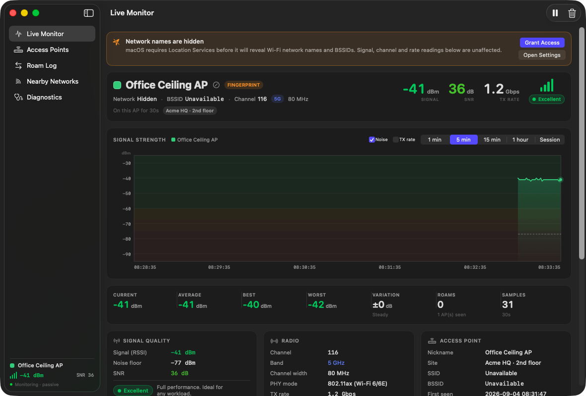

# WifiHigh5

A macOS app for monitoring the current Wi-Fi connection. It runs in a standard
window and in the menu bar.



## What it shows

**Live Monitor** shows signal strength, noise, SNR, transmit rate, and a rolling
chart. It also gives a short status summary and a recommended next step.

The chart uses a separate colour for each access point. A colour change marks a
roam. The scale control above it zooms vertically, from the full range of Wi-Fi
signal down to a view that fits the readings, so a change of a few dB is easy to
see; zoomed scales never crop a reading. Drag the handle under the chart to make
it taller. Dashed vertical lines mark each connection change. Point to the chart to
see the reading at that time. Optional overlays show noise and transmit rate.

**Network Map** shows the path from this Mac to the access point and router. It
labels each item as measured, inferred, or unobserved. The map does not claim to
be a complete network inventory. Pan, zoom, or select a node to inspect its data.

**Observed Devices** lists IPv4 devices already present in the Mac's ARP cache.
It is passive and sends no packets. Quiet, isolated, and IPv6-only devices may
be absent.

**Access Points** lists each AP that served the connection. Search the list or
add a nickname, site, colour, and notes.

**Connection Changes** lists each association, roam, and reconnect. It shows the
signal before and after the change. It also flags roams to a weaker AP.

**Nearby Networks** runs an on-demand Wi-Fi scan. It shows nearby APs, channel
crowding, and other radios that serve the current network. AP count does not
measure airtime use or interference.

**Walkthroughs** records signal data while you walk through a site. Mark rooms
as you go, then export an HTML or CSV report.

**Diagnostics** shows permission status, sampling controls, storage paths, and
CSV export. It also explains the app's network activity.

Open **Help > WifiHigh5 Help** (Command-?) for definitions, useful ranges, and
troubleshooting steps.

## Naming access points

Select the **+** next to an AP name to add a nickname, site, notes, and chart
colour.

Nicknames are keyed to the AP's BSSID and stored locally as JSON inside the
app's sandbox container:

```
~/Library/Containers/com.rblihovde.wifihigh5/Data/Library/Application Support/WifiHigh5/access-points.json
```

Builds before 1.2 were not sandboxed and kept this folder in
`~/Library/Application Support`. The first sandboxed launch moves it into the
container automatically.

The app keeps this file on the Mac. Use the Access Points tab to export or import
names.

## The network map

The map shows signal and traffic paths. It does not show physical AP placement.
Line style shows the source of each connection:

| Style | Meaning |
|---|---|
| Solid blue | Measured from a system API |
| Solid amber | Inferred from measured data. The node shows the evidence. |
| Grey dashed | Not observable from this Mac |

If another service owns the default route, the map identifies that service. It
still shows the local Wi-Fi path.

The internet node is always dashed because the app does not test upstream
connectivity. The app cannot see switches between the AP and router. It marks
that part of the path as unobserved.

The app can infer that the router and AP are one device. It makes this inference
when their hardware addresses have the same vendor prefix and are close in
value. The inspector shows the evidence. The check excludes software-assigned
and multicast addresses.

The app identifies hardware vendors with an embedded copy of the IEEE MAC
registry. Vendor results also support the single-device inference.

The app does not download the database at runtime. To update the embedded copy,
run:

```bash
./tools/update-oui.sh
```

The script downloads the MA-L, MA-M, and MA-S registries from IEEE. It validates
the files and rebuilds `Resources/OUI.txt`. The current file contains 53,187
blocks. Vendor lookup uses the longest matching prefix.

The app does not assign a vendor to a randomized address. It reports that the
address was assigned by software.

"Observed Devices" comes from the Mac's ARP cache. The app limits results to the
active Wi-Fi interface and local subnet. The list is not a network inventory.
It can omit quiet, isolated, or IPv6-only hosts. The app does not probe these
addresses.

Each row is given a role from settings the Mac already holds: the gateway it was
told to use, the DHCP and DNS servers in its lease, and the BSSID it is
associated with. A device type is suggested from the strongest evidence
available — a model the device published, the name it answers to, the services
it offers, then the company that made its address. A suggestion is always worded
as a likelihood and never replaces a name you set.

Double-click a row to give a device a name, a type and a note. Labels follow the
hardware address rather than the IP, so they survive a new lease, and they are
written to disk only for devices you have actually labelled. Export or import
them from the Export menu.

Arrivals and departures are worked out by comparing successive reads of the
cache. The first read is a baseline; anything appearing later arrived while you
were watching. A device is called gone only after two consecutive misses. That
history is held in memory and never written to disk.

## Exporting a report

**Export PDF** on the Network Map draws the map, a device schedule, the link and
radio data, and a sheet describing how every figure was obtained. Everything is
vector, so it prints cleanly and stays sharp at any zoom.

Sheets carry a ruled border, zone markers, a legend keyed to line style, and a
title block naming the site, the network and the time. Each node gets a
reference designator so the schedules can cite it. The last sheet records
whether anything in the set was obtained by asking rather than watching.

The site name comes from the site you gave the current access point, and falls
back to the network name.

## Walking a site

The live chart shows current conditions. A walkthrough records conditions across
a site.

Start a recording from the **Walkthroughs** tab. Press **Command-M** and enter a
name when you reach each room.

Each room marker creates a waypoint. The app records its timestamp when you
press Command-M, before you enter the label. Reports group later readings by
waypoint. The app also offers recent labels for reuse.

The optional low-signal alert sounds when signal drops below the selected
threshold. It resets after the signal recovers by several dB.

The app saves completed walkthroughs on the Mac. **Export Report** creates one
self-contained HTML file. It includes a chart, room table, AP list, and method.
**Export CSV** assigns each reading to its waypoint.

The chart shades gaps caused by sleep or a paused session. It does not draw a
line across missing readings.

## Safe to run onsite

The app reads the current Wi-Fi link and assigned IP settings. It does not
capture traffic, probe other hosts, access credentials, or send telemetry.

Four optional features transmit. All are off until you turn them on:

- **Scan Now** sends standard Wi-Fi probe requests.
- **Gateway ping** sends one ICMP echo per second to your own default router.
- **Identify ▸ Ask Devices to Identify Themselves** sends Bonjour queries on the
  local subnet and asks whatever answers to describe itself.
- **Identify ▸ Look Up Names in DNS** sends one reverse lookup per address to
  the name servers this network gave the Mac.

The last two each show a dialog before anything is sent, saying what is
transmitted, what comes back, where it will be logged afterwards, and what the
feature is for. Cancel is the default button. Rows carrying anything obtained
that way are marked `ASKED`, and exports record which rows those were.

Both the direct download and the App Store build run in the macOS App Sandbox,
with the same narrow set of capabilities: outgoing connections, files you choose
in an Open or Save panel, and Location for the network name.

Imported files are checked before anything in them is used: size, record count,
field lengths and identifier formats, with anything the app would not have
written itself corrected or dropped. CSV exports neutralise any cell that a
spreadsheet would read as a formula, since several columns carry names that
devices on the network chose.

The app does not scan ports, sweep addresses, or capture traffic, and it cannot
see traffic between two other devices: Wi-Fi delivers frames only to the client
they are addressed to, and each client holds a different key.

The Diagnostics tab describes all of this in the app.

## The Location Services requirement

macOS classifies Wi-Fi network names as location data. Without Location Services,
the system hides the **SSID**, **BSSID**, and **country code**. Signal, noise,
SNR, channel, band, width, PHY mode, rate, and IP details remain available.

Grant access from the Live Monitor banner or from System Settings. The app does
not show the permission request at launch.

If macOS refuses access without a prompt, check these settings:

- System Settings ▸ Privacy & Security ▸ Location Services
- System Settings ▸ Screen Time ▸ Content & Privacy ▸ Location Services

Without a BSSID, the app uses SSID, channel, band, and security as an AP
fingerprint. Two APs can share this fingerprint. The interface marks these
results as `FINGERPRINT`.

## Building

Requires Xcode command line tools. The build script compiles, bundles and signs:

```bash
./build.sh
```

The result is `build/WifiHigh5.app`, which is then installed to
`/Applications`. That install step matters: the Location Services grant is bound
to the installed bundle's path, so running out of `build/` means re-granting
each time. Pass `SKIP_INSTALL=1` to build without installing.

Run the tests with:

```bash
./run-tests.sh
```

The tests cover signal calculations, AP identity, waypoints, export escaping,
permission states, subnet limits, topology, and large result sets.

## Keyboard shortcuts

| Shortcut | Action |
|---|---|
| `⌘P` | Pause / resume sampling |
| `⌘K` | Review and clear the session history |
| `⌘R` | Scan nearby networks |

## Notes

- Sampling runs at 1 s by default. You can select 0.25–5 s in Diagnostics.
  Sampling reads the Wi-Fi driver on this Mac and sends nothing on the network,
  at any rate.
- History is held in memory as a rolling one-hour window at every sampling rate,
  and starts fresh each launch.
  Export to CSV before quitting if you need to keep a walkthrough.
- Closing the window leaves the app running in the menu bar, which shows live
  signal while you walk a site. Quit from the menu bar panel.

## Layout

```
Sources/
  Model/      WiFiSample, AP identity, quality thresholds, nickname store,
              saved walkthroughs
  Service/    CoreWLAN polling, IP/DHCP reads, ICMP pinger, scanner, reports
  View/       Dashboard, chart, AP manager, change log, walkthroughs, scanner,
              diagnostics, help
Tests/        Model and export checks
Resources/    Info.plist, entitlements, app icon
build.sh      Compile, bundle, sign, install
run-tests.sh  Compile and run the checks
```
